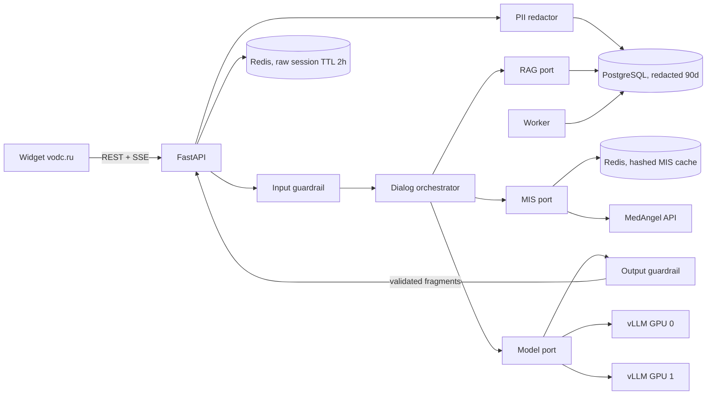

# Архитектура MVP

Обоснования решений находятся в [ADR](adr/README.md), а проверяемый результат
этапа 2 — в [STAGE_2_ARCHITECTURE.md](STAGE_2_ARCHITECTURE.md).

## Границы модулей

- `app/domain` — состояния, карточки, safety и бизнес-правила без I/O.
- `app/orchestrator.py` — порядок retrieval/tool/model вызовов.
- `app/ports.py` — внутренние контракты инфраструктуры.
- `app/adapters` — Redis, PostgreSQL, pgvector, vLLM и «МедАнгел».
- `app/main.py` — HTTP/SSE, CORS, rate limits, health и метрики.
- `app/worker.py` — переиндексация allowlist и удаление истёкших данных.

Направление зависимостей проверяет `scripts/check_architecture.py`. Domain,
ports, orchestrator и HTTP-слой не импортируют конкретные адаптеры.

LLM не меняет состояние воронки и не формирует параметры записи. Её поток
проверяется по накопленным завершённым фрагментам до отправки пользователю.
Любое действие карточки подписывается HMAC, привязано к сессии и повторно
проверяется по МИС. При отсутствии источников генерация не вызывается.
Каталог намерений и разрешения на обращения к RAG/МИС определены в
`app/domain/intents.py`; классификация выполняется детерминированно после
safety gateway и записывается только как обезличенное событие. Обнаруженные
ПДн и другой заблокированный input не сохраняются даже в raw-сессии.

## Публичные интерфейсы

- `POST /api/v1/sessions`
- `POST /api/v1/sessions/{id}/messages/stream`
- `POST /api/v1/sessions/{id}/booking-link`
- `POST /api/v1/sessions/{id}/events`
- `GET /health/live`
- `GET /health/ready`

События SSE: `status`, `text_delta`, `sources`, `cards`, `state`, `error`,
`done`. Старый `/chat` намеренно отсутствует.

## Данные

Разрешённые raw сообщения находятся только в Redis. В PostgreSQL записывается
результат локального redaction. В клиентской аналитике разрешены только
фиксированные события и свойства; произвольный текст отклоняется схемой API.
Redis работает без AOF/RDB, поэтому raw-сессии не попадают на диск и
теряются при перезапуске, что является ожидаемым безопасным поведением.

Цены, врачи и слоты всегда динамические данные МИС. RAG используется только
для утверждённых публичных материалов из `knowledge_base/sources.json`.
Ingestion применяет новый снимок источников одной транзакцией и повторно
эмбеддит только изменённый контент. Retrieval объединяет HNSW cosine
similarity и русский полнотекстовый GIN-поиск, после чего отбрасывает
неактуальные источники и результаты ниже порога. Источник с признаками
инструкции для модели отклоняется до embedding и также не загружается
локальным fallback.

Read-only MIS adapter проверяет response envelope, типы, timezone и связи
`service/doctor/branch/slot` до создания карточек. Кеш справочников и
расписания разделён по TTL; cache key не содержит открытого пользовательского
текста. Выбор сущности и booking redirect всегда выполняют свежий запрос в
обход кеша. Изменяющих методов МИС во внутреннем порте нет.
