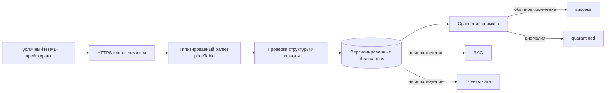

# Автоматический аудит каталога услуг

## Назначение

Контур загружает публичный HTML-прейскурант ВОККДЦ и сохраняет
версионированные наблюдения для сравнения с МИС. Это `audit-only` источник:
он не подключён к оркестратору, RAG, карточкам услуг и формированию ссылки
записи.

Цены, врачи и слоты в пользовательском интерфейсе по-прежнему поступают
только через адаптер МИС. Публичный сайт позволяет обнаружить расхождения,
но не заменяет контракт «МедАнгел».



## Контракт парсера

Ожидается таблица `table#priceTable`:

- `tr.pricetable-parent-child[data-depth]` — очередной уровень категории;
- `tr.pricetable-child` — код, наименование и цена услуги.

Код услуги состоит из 10 цифр и является бизнес-идентификатором. Один код
может присутствовать в нескольких категориях и иметь несколько detail URL.
Вся иерархия сохраняется в `category_path`, включая фактически
использующиеся уровни 2–5. Поэтому одна строка сайта сохраняется как
отдельное наблюдение, а сравнение полноты выполняется по множеству кодов.

Запуск получает статус `failed`, если ожидаемая таблица отсутствует или
страницу невозможно безопасно загрузить. Разобранный снимок помещается в
карантин, если:

- отсутствуют валидные строки;
- код или наименование имеют неизвестный формат;
- detail URL выходит за HTTPS allowlist `vodc.ru`;
- число уникальных услуг ниже `CATALOG_AUDIT_MIN_SERVICES`;
- доля исчезнувших кодов превышает
  `CATALOG_AUDIT_MAX_REMOVED_RATIO`;
- одному коду соответствуют конфликтующие названия.

Разные числовые цены у одного кода фиксируются как warning. Изменение цены
не обновляет данные чата и требует последующего сравнения с МИС.

## Хранение

Миграция `003_catalog_audit.sql` создаёт:

- `catalog_audit_runs` — статус, HTTP-метаданные, hash и статистика запуска;
- `catalog_service_observations` — строки каталога в рамках конкретной версии;
- `catalog_audit_issues` — структурированные причины warning и quarantine.

Снимки неизменяемы. Ответы `304 Not Modified` записываются отдельным запуском
со ссылкой `previous_run_id` в `stats`, без копирования строк предыдущей
версии.

## Запуск и проверка

Аудит выполняется в конце обычного цикла worker. Его ошибка не отключает и
не изменяет последний активный RAG:

```bash
docker compose --profile gpu run --rm worker python -m app.worker --once
```

Последние запуски:

```sql
SELECT completed_at, status, service_count, row_count, issue_count, stats
FROM catalog_audit_runs
ORDER BY completed_at DESC
LIMIT 10;
```

Причины карантина:

```sql
SELECT i.code, i.severity, i.service_code, i.details
FROM catalog_audit_issues i
JOIN catalog_audit_runs r ON r.id = i.run_id
WHERE r.id = '<run-id>'
ORDER BY i.severity DESC, i.code, i.service_code;
```

Prometheus публикует:

- `vodc_catalog_audit_runs_total`;
- `vodc_catalog_audit_services`;
- `vodc_catalog_audit_issues`.

Alerts срабатывают на ошибку загрузки и на новый quarantined-снимок.

## Следующее расширение

После получения OpenAPI «МедАнгел» необходимо добавить отдельное сравнение
по `service_code`: наличие услуги, нормализованное название и цена. Только
МИС может заполнять пользовательский structured catalog. Для описаний услуг
потребуется отдельный crawler/staging-процесс с risk tier и медицинским
согласованием; автоматически переносить весь текст detail-страниц в RAG
нельзя.
