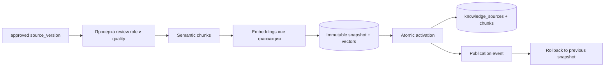

# Controlled publisher утверждённых источников

## Назначение

Publisher — единственная разрешённая граница между review-gated staging и
активным RAG. Он не запускается worker-ом и требует явной команды оператора.
Без `--apply` CLI показывает только план.



## Gate

Версия допускается к плану, только если:

- candidate включён;
- это последняя approved-версия candidate;
- существует записанное решение approved;
- отсутствуют quality issues;
- medical source утверждён с `reviewer_role=medical_owner`;
- URL не занят ручным источником из `sources.json`;
- версия ещё не является активным snapshot.

Перед транзакцией повторно проверяются prompt injection, динамическая цена,
размерность и конечность embeddings. Любая ошибка прекращает операцию до
изменения активного индекса.

## Роли review

```bash
DATABASE_URL='postgresql://...' .venv/bin/python \
  scripts/review_source_version.py \
  '<version-uuid>' approved \
  --reviewer 'Фамилия И.О.' \
  --reviewer-role medical_owner \
  --reason 'Материал сверён с утверждённым медицинским регламентом'
```

Роли:

- `content_owner` — организационные и сервисные описания;
- `medical_owner` — обязательна для `risk_tier=medical`.

Quarantined-версию утвердить нельзя.

## Dry-run и публикация

Просмотр плана не вызывает embedding endpoint:

```bash
DATABASE_URL='postgresql://...' .venv/bin/python \
  scripts/publish_staged_sources.py --limit 10
```

Активация:

```bash
DATABASE_URL='postgresql://...' .venv/bin/python \
  scripts/publish_staged_sources.py \
  --apply --limit 10 --actor 'Фамилия И.О.'
```

Embeddings строятся до открытия транзакции. Внутри одной транзакции
создаётся неизменяемый snapshot, копируются chunks, переключается activation
и записывается publication event.

Manual URL не перезаписывается. Чтобы заменить ручной snapshot
автоматизированным, сначала требуется отдельное осознанное изменение
`sources.json` и повторное review.

## Проверка и rollback

После публикации:

```bash
.venv/bin/python scripts/evaluate_retrieval.py \
  /secure/retrieval_gold.json --k 5 --minimum-recall 0.90
```

При регрессии выполнить rollback. Без `--snapshot-id` выбирается предыдущий
snapshot последней активации:

```bash
DATABASE_URL='postgresql://...' .venv/bin/python \
  scripts/publish_staged_sources.py \
  --rollback-url 'https://vodc.ru/path/' \
  --actor 'Фамилия И.О.'
```

Явный snapshot:

```bash
DATABASE_URL='postgresql://...' .venv/bin/python \
  scripts/publish_staged_sources.py \
  --rollback-url 'https://vodc.ru/path/' \
  --snapshot-id '<snapshot-uuid>' \
  --actor 'Фамилия И.О.'
```

Rollback атомарно восстанавливает metadata, chunks, embeddings и activation,
после чего также записывает publication run/event.

## Ограничение текущего gate

Gold set остаётся внешним утверждаемым артефактом, поэтому publisher не
может честно выполнить Recall@5 внутри транзакции. Операционный порядок:
dry-run → apply ограниченного batch → production retrieval eval → rollback
при регрессии. Публичный пилот запрещён без утверждённого gold set.
