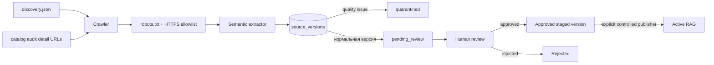

# Автоматический staging семантических источников

## Граница безопасности

Worker автоматически обнаруживает и извлекает потенциальные источники, но
никогда не публикует их непосредственно в `knowledge_sources` или
`knowledge_chunks`. Между сайтом и активным RAG всегда находится
версионированный staging и решение ответственного владельца.



Даже статус `approved` означает только согласованную staging-версию.
Переход в активный RAG выполняется отдельно и только явной командой
controlled publisher.

## Источники обнаружения

`knowledge_base/discovery.json` содержит утверждённые стартовые URL:

- организационные страницы;
- индекс подготовки к исследованиям;
- допустимый path prefix для ссылок следующего уровня.

Навигационные seeds могут иметь `discovery_only=true`: их ссылки
регистрируются, но сам индекс не создаёт версию контента.

После успешного audit публичного прейскуранта detail URL услуг также
регистрируются как `service_description` с `risk_tier=medium`. Код услуги
сохраняется как метаданные и в дальнейшем свяжет текст с каталогом МИС.
Detail URL, исчезнувшие из последнего снимка каталога, автоматически
отключаются от последующих обходов.

Crawler:

- принимает только HTTPS URL `vodc.ru` и `www.vodc.ru`;
- удаляет query и fragment из canonical URL;
- проверяет `robots.txt` до загрузки;
- контролирует redirect allowlist, Content-Type и размер;
- использует ETag/Last-Modified, когда сайт их предоставляет;
- обрабатывает ограниченный batch с задержкой между запросами.

## Извлечение

Контент извлекается из `main.page`/`main` и группируется по заголовкам
`h2`–`h4`. Удаляются формы, навигация, breadcrumbs, scripts, reviews и
другой шаблонный контент.

Для `service_description` строки с динамической ценой исключаются.
Подготовка, лекарства, противопоказания и иные медицинские материалы не
публикуются автоматически независимо от результата технической проверки.

Quality issues:

- слишком короткий материал;
- косвенная prompt injection;
- оставшаяся динамическая цена в описании услуги.

Версия с issue получает `quarantined`, остальные — `pending_review`.

## Схема и решения

Миграция `004_source_staging.sql` создаёт:

- `source_stage_runs`;
- `source_candidates`;
- `source_versions`;
- `source_version_reviews`.

Список ожидающих проверки:

```sql
SELECT v.id, c.url, c.source_type, c.risk_tier, c.service_code,
       v.title, v.quality_issues, v.fetched_at
FROM source_versions v
JOIN source_candidates c ON c.id = v.candidate_id
WHERE v.review_status IN ('pending_review', 'quarantined')
ORDER BY c.risk_tier DESC, v.fetched_at;
```

Решение записывается с именем ответственного и обоснованием:

```bash
DATABASE_URL='postgresql://...' .venv/bin/python \
  scripts/review_source_version.py \
  '<version-uuid>' approved \
  --reviewer 'Контент-владелец' \
  --reason 'Сверено с утверждённой страницей и регламентом'
```

`quarantined` нельзя утвердить: нужно исправить причину и получить новую
версию. Медицинские материалы проверяет медицинский ответственный.

## Эксплуатация

Переменные:

- `SOURCE_STAGING_ENABLED`;
- `SOURCE_DISCOVERY_MANIFEST_PATH`;
- `SOURCE_STAGING_BATCH_SIZE`;
- `SOURCE_STAGING_DELAY_MS`;
- `SOURCE_STAGING_MAX_BYTES`.

Метрики:

- `vodc_source_staging_runs_total`;
- `vodc_source_staging_created`;
- `vodc_source_staging_quarantined`.

Controlled publisher реализован отдельно и описан в
`docs/CONTROLLED_PUBLISHER.md`. Он запускается только явной командой,
сохраняет immutable embedding snapshots и поддерживает rollback. До
запуска publisher активный RAG продолжает использовать только ручной
`knowledge_base/sources.json`.
