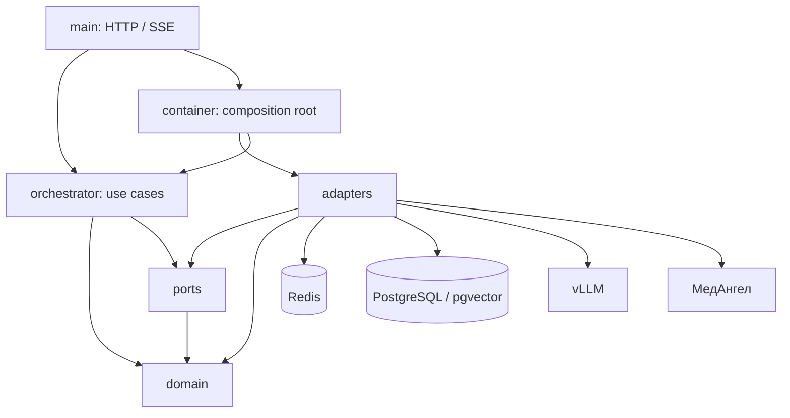
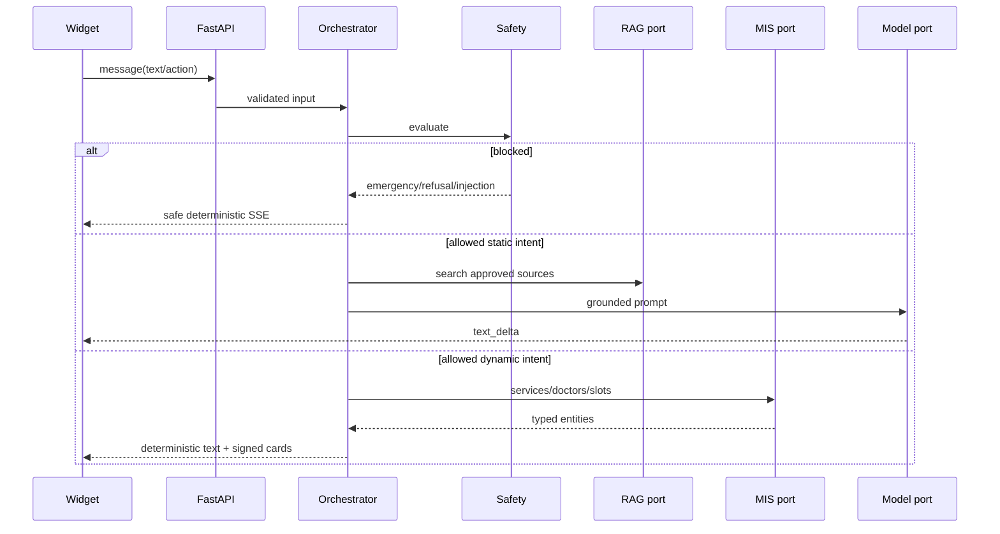

# Этап 2. Архитектура и прототип модели

Статус: архитектура и benchmark-контур реализованы. Основная модель выбрана.
Фактическое качество и производительность checkpoint должны быть подтверждены
на целевом сервере 2×RTX 5090.

## Соответствие DOCX

| Результат | Артефакт |
|---|---|
| Архитектура | `docs/ARCHITECTURE.md`, ADR-0001…0004 |
| Одна основная модель | `Qwen/Qwen3.5-9B`, `config/model_candidates.json` |
| Контрольный набор | `evals/model_prototype.json`, 20 сценариев |
| Быстрый прототип агента | safety → intent → RAG/МИС → SSE в `app/orchestrator.py` |
| Контракты модулей | `app/ports.py` и typed `ApplicationContainer` |
| Контроль границ | `scripts/check_architecture.py` и unit test |

## Компоненты



Стрелки показывают compile-time зависимости. `domain` не импортирует I/O
библиотеки. `orchestrator` знает только порты и доменные типы. Конкретные
адаптеры выбирает composition root.

## Последовательность сообщения



## Контракты

| Порт | Ответственность | Ошибка границы |
|---|---|---|
| `SessionStore` | raw session, TTL, rate limit | реализация сообщает readiness |
| `EventStore` | redacted messages и funnel events | реализация сообщает readiness |
| `KnowledgePort` | поиск `SourceRef` | `KnowledgeUnavailable` |
| `ModelPort` | grounded streaming | `ModelUnavailable` |
| `MedAngelPort` | услуги, врачи, слоты, validation | `MedAngelUnavailable` |

Инфраструктурные исключения `httpx`, `asyncpg` и Redis не выходят в
оркестратор.

## Выбор модели

| Модель | Формат | Параметры | weights + KV | Роль |
|---|---|---:|---:|---|
| Qwen3.5-9B | BF16 | 9,65B | 22,98 GiB | основная |
| Qwen3.5-35B-A3B | GPTQ Int4 | 35,95B / ≈3B active | 25,85 GiB | challenger |

Общие значения MMLU-Pro, GPQA и IFEval взяты из официальных model card и
не считаются release gate. Точные quantized checkpoint не представлены под
своими ID в выбранных независимых HF leaderboard. Решение принимает
контрольный набор VODC, затем retrieval gold set.

9B выбрана из-за запаса памяти и возможности держать embedding на GPU 0.
35B допускается только при доказанном доменном улучшении без OOM и деградации
TTFT.

## Запуск быстрого benchmark

Для уже поднятых OpenAI-compatible endpoints:

```bash
.venv/bin/python scripts/benchmark_models.py \
  --candidate Qwen3.5-9B=http://localhost:8000 \
  --candidate Qwen3.5-35B-A3B-GPTQ-Int4=http://localhost:8002 \
  --repetitions 3 \
  --minimum-pass-rate 1.0 \
  --maximum-ttft 10 \
  --output artifacts/model-benchmark.json \
  --enforce
```

TTFT считается по первому непустому `content`, а не по reasoning/status
дельте. Отчёт содержит failed cases и фрагменты ответов. Каталог `artifacts/`
не должен попадать в Git, так как ответы могут требовать ручной проверки.

## Gate этапа

Локально:

- architecture check проходит;
- 20 control cases валидны и benchmark protocol покрыт тестами;
- primary/challenger ID, revision, лицензия и память зафиксированы;
- быстрый агент использует production system prompt и non-thinking mode.

На целевом GPU:

- обе модели проходят control set без критической ошибки;
- p95 TTFT не более 10 секунд;
- нет OOM при 10 последовательностях и контексте 8192;
- основная модель подтверждается либо challenger продвигается по
  документированному правилу.

Без GPU-отчёта этап готов на уровне репозитория, но модель остаётся условно
принятой для production.
