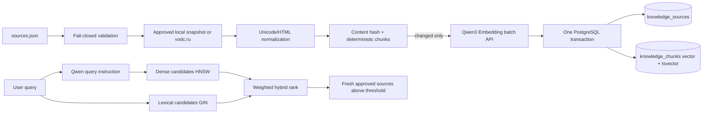

# Этап 4. База знаний и RAG

Статус: pipeline, схема, hybrid retrieval, локальный fallback, метрики и
evaluation-контур реализованы. Production-приёмка требует целевых PostgreSQL,
embedding endpoint и утверждённого gold set из 100–200 запросов.

## Реализованный поток



## Реестр источников

`knowledge_base/sources.json` является единственной точкой разрешения
контента. Для каждой записи обязательны:

- уникальные `filename` и canonical HTTPS URL на `vodc.ru`;
- владелец;
- дата проверки, не находящаяся в будущем;
- необязательная дата истечения;
- локальный snapshot либо загрузка с разрешённого домена.

Источник автоматически становится неактивным через
`SOURCE_MAX_AGE_DAYS` (180 дней по умолчанию). Redirect за пределы
`vodc.ru`, traversal локального пути, неизвестный content type, превышение
размера и пустой контент останавливают весь цикл до изменения PostgreSQL.

Текущий минимальный реестр содержит только статические данные:

- сведения о центре;
- контакты и адреса;
- официальные правила подготовки к лабораторным исследованиям.

Цены, врачи, филиалы в карточках, расписание и слоты исключены из snapshots
и всегда поступают из МИС.

## Индексация

Миграция `002_knowledge_pipeline.sql` добавляет:

- model ID, immutable revision, dimensions и chunking к версии источника;
- SHA-256 каждого чанка;
- generated Russian `tsvector` и GIN index;
- индекс актуальности источников;
- журнал успешных запусков `knowledge_index_runs`.

Worker сначала загружает и нормализует все активные источники, вычисляет
hash и получает embeddings только для изменившихся документов. Перед
записью проверяются число векторов, размерность 1024 и отсутствие
NaN/Infinity. Затем весь новый снимок применяется одной транзакцией.

Если загрузка или embedding любого источника завершились ошибкой,
предыдущий индекс остаётся целиком доступным. Источники, удалённые из
реестра, выключенные или просроченные, отключаются авторитетным циклом и их
чанки удаляются.

Запуск:

```bash
docker compose --profile gpu run --rm worker python -m app.worker --once
```

Повторный запуск без изменения контента не вызывает embedding API и не
перезаписывает чанки.

## Retrieval

Qwen3-Embedding получает instruction только на стороне запроса:

```text
Instruct: Given a Russian-language website query, retrieve approved VODC passages that answer the query.
Query: <запрос>
```

Документы индексируются без instruction. Это соответствует контракту
выбранной embedding-модели. Полный зафиксированный контракт находится в
`config/embedding_model.json`.

PostgreSQL строит два ограниченных набора кандидатов:

- cosine similarity по HNSW;
- полнотекстовый поиск русского текста по GIN.

Итоговый score:

```text
0.8 × dense_similarity + 0.2 × normalized_lexical_rank
```

Порог по умолчанию — `0.3`, число кандидатов — `limit × 8`. В результат
попадают только включённые, непросроченные источники нужной версии
embedding. Размер excerpt увеличен до 800 символов, чтобы LLM получала
содержательный проверенный контекст.

Без PostgreSQL используется read-only lexical fallback непосредственно над
теми же локальными snapshots. Старый embedding JSON удалён как
несовместимый артефакт размерности 768.

## Проверка качества

Структура утверждённого набора:

```bash
.venv/bin/python scripts/validate_retrieval_gold.py \
  /secure/retrieval_gold.json
```

Фактический Recall@5 production-адаптера:

```bash
.venv/bin/python scripts/evaluate_retrieval.py \
  /secure/retrieval_gold.json \
  --k 5 \
  --minimum-recall 0.90 \
  --output artifacts/retrieval-report.json
```

Отчёт содержит Recall@5, результаты по каждому запросу и число критических
ошибок. Gate проходит при Recall@5 не ниже 90% и нуле критических ошибках.

## Gate этапа

Репозиторный gate:

- schema 1024 согласована с Qwen3-Embedding-0.6B;
- manifest работает fail-closed;
- обновление индекса атомарно и идемпотентно;
- unchanged sources не эмбеддятся повторно;
- hybrid SQL ограничивает источники по freshness/model/dimension;
- динамические данные МИС отсутствуют в snapshots;
- local fallback и production retrieval покрыты тестами;
- RAG latency/result и ingestion result/chunks доступны в Prometheus.

Внешний gate:

- snapshots утверждены контент- и медицинским владельцами;
- миграции применены на целевой PostgreSQL;
- первый индекс построен целевым embedding endpoint;
- gold set содержит 100–200 утверждённых запросов;
- Recall@5 ≥ 90%, критических промахов нет.
