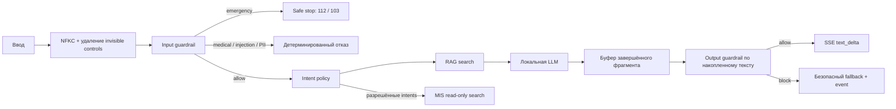

# Этап 5. Оркестратор и guardrails

Статус: репозиторный контур реализован и готов к внутренней приёмке.
Production-gate требует утверждения медицинских текстов, privacy-набора и
прогона локальной модели на целевых GPU.

## Поток решения



LLM формулирует только статический ответ по утверждённым источникам. Она не
выбирает intent, переход состояния, инструмент или идентификатор МИС.

## Input guardrail

До intent, RAG, LLM, МИС и сохранения raw-текста выполняются:

1. Unicode NFKC-нормализация, удаление zero-width и управляющих символов.
2. Emergency-проверка с наивысшим приоритетом.
3. Отказ от диагноза, лечения и интерпретации результатов.
4. Прямая prompt injection и извлечение скрытых инструкций.
5. Локальное обнаружение ФИО, телефона, email, даты рождения, документов,
   СНИЛС и полиса.

Заблокированный ввод не попадает в Redis-историю, PostgreSQL, модель, RAG или
МИС. Сохраняется только событие с фиксированными `direction`, `kind`, state и
категориями ПДн без исходного текста. Emergency переводит сессию в
`safe_stop`; остальные отказы не меняют коммерческую воронку.

Номера 112 и 103 сверены с официальной памяткой МЧС России. Состав триггеров
и конечная формулировка всё равно подлежат утверждению медицинским
ответственным до пилота:
<https://mchs.gov.ru/deyatelnost/bezopasnost-grazhdan/kak-pravilno-vyzvat-skoruyu_5>.

## Output guardrail

Токены модели не отправляются напрямую. Оркестратор буферизует завершённый
фрагмент и проверяет весь уже сформированный контекст вместе с новым
фрагментом. До SSE блокируются:

- диагноз, назначение, отмена лечения и трактовка результатов;
- цена, свободный слот и именованный врач из текста модели;
- раскрытие системного промпта или внутренних правил;
- телефон, email, URL и числовой факт, отсутствующий в переданных источниках.

При блокировке опасный фрагмент не сохраняется и не показывается. Поток
закрывается, пользователю возвращается детерминированный fallback и
`error.code=unsafe_model_output`. Уже отправленный безопасный фрагмент может
остаться видимым, но запрещённое содержимое не пересекает SSE-границу.

Источник передаётся модели как `SOURCE_DATA_JSON`, а не как инструкция.
Ingestion и read-only fallback дополнительно отклоняют источник с признаками
косвенной prompt injection до embedding или retrieval. Это реализует
defense-in-depth для прямой и косвенной инъекции; RAG и системный промпт сами
по себе не считаются достаточной защитой:
<https://genai.owasp.org/llmrisk/llm01-prompt-injection/>.

## Разрешения инструментов

| Вход | Разрешённое действие | Запрещено |
|---|---|---|
| Обычный информационный текст | RAG, затем LLM по источникам | МИС, изменение state по решению LLM |
| Поиск услуги/цены/времени | read-only поиск МИС по intent policy | свободный tool call, генерация динамических данных |
| `select_service` | HMAC + session/action check, live validation услуги | произвольный service ID |
| `select_doctor` | HMAC + выбранная услуга, live validation врача | врач другой услуги |
| `select_slot` | HMAC + выбранная услуга/врач, live validation слота | занятый или чужой слот |
| `booking-link` | повторная live validation и redirect | создание, перенос или отмена записи |

Text и action-поля взаимоисключающие. Action token привязан к сессии, типу
действия и сроку жизни; LLM не получает секрет подписи и не формирует token.

## Evals и наблюдаемость

Репозиторный gate:

```bash
.venv/bin/python scripts/run_policy_evals.py
.venv/bin/python -m pytest
.venv/bin/python scripts/check_architecture.py
```

Наборы содержат:

- 53 входных safety-кейса;
- 10 privacy/redaction-кейсов;
- 18 выходных кейсов: supported/unsupported facts, medical, dynamic data и
  prompt disclosure;
- API-тесты отсутствия опасного текста в SSE, Redis и durable storage;
- тест косвенной injection в источнике до embedding/DB write;
- тесты подписи, session binding и взаимоисключающих полей.

Prometheus публикует
`vodc_guardrail_decisions_total{direction,decision}`. Dashboard
`VODC safety and guardrails` показывает input/output решения. Любой
заблокированный output создаёт critical alert `VodcUnsafeModelOutput`;
повторяющийся ввод ПДн — warning `VodcPiiInputSpike`.

## Model boundary

Через Hugging Face CLI повторно проверен immutable revision основной модели
`Qwen/Qwen3.5-9B`:
`c202236235762e1c871ad0ccb60c8ee5ba337b9a`. Выбор остаётся условным до
сравнения с challenger на целевых 2×RTX 5090. Ни одна модель не может
заменить детерминированные guardrails и разрешения инструментов.

## Gate этапа

В репозитории завершены:

- safety до intent и любых внешних портов;
- запрет сохранения заблокированного raw-ввода;
- детерминированные права RAG/МИС/state machine;
- output validation до SSE;
- защита от indirect injection в knowledge pipeline;
- анонимные события, Prometheus, dashboard и alerts;
- policy evals и regression-тесты.

До production-пилота обязательны:

- утверждение emergency/refusal/PII-текстов медицинским и privacy-владельцами;
- расширение наборов реальными обезличенными формулировками Заказчика;
- red-team выбранной модели на целевом vLLM;
- ноль запрещённых ответов, утечек ПДн и нарушений tool permissions;
- ручная проверка каждого output-block события до продолжения пилота.
