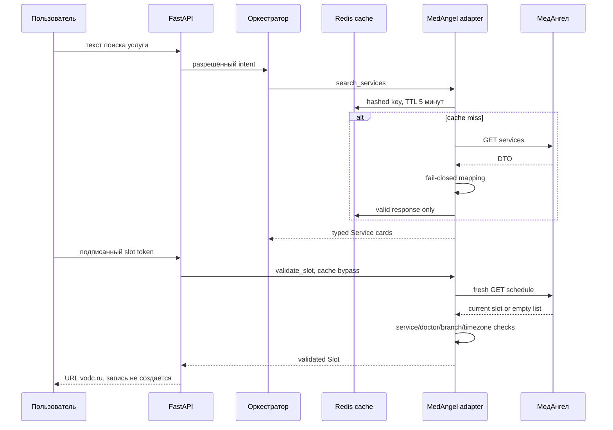

# Этап 6. Интеграция с МИС

Статус: безопасная репозиторная граница, кеширование, live validation,
fallback, метрики и mock contract tests реализованы. Production-приёмка
заблокирована до получения фактического Swagger/OpenAPI «МедАнгела»,
обезличенных fixtures и параметров штатной формы записи.

## Поток



## Реализовано

- read-only порт без create/update/cancel методов;
- относительные конфигурируемые paths без возможности сменить host;
- Bearer authentication как временный mapping;
- строгая нормализация Service, Doctor и Slot;
- проверка стабильных ID, конфликтующих дубликатов и связей сущностей;
- timezone-aware slots, нормализованные в `Europe/Moscow`;
- Redis TTL 5 минут для справочников и 30 секунд для слотов;
- hashed cache keys и минимизированные DTO values без пользовательского текста;
- bounded in-memory fallback и single-flight запросы;
- cache bypass при каждом выборе сущности и перед booking redirect;
- повторная проверка текущего slot token и всей выбранной цепочки;
- retries только для timeout/network/429/5xx;
- потоковый лимит ответа МИС 2 МБ до JSON mapping;
- безопасный fallback без выдуманных цен, врачей и времени;
- Prometheus-метрики, Grafana dashboard и alerts;
- mock-тесты успешных ответов, кеша, concurrency, schema drift,
  исчезнувшего слота, HTTP ошибок и redirect permissions.

## Не считается завершённым без Заказчика

Текущие aliases `id/service_id`, `title/name`, `starts_at/start` лишь
изолируют неопределённость. Они не доказывают совместимость с реальным API.
Для закрытия этапа нужны:

1. Swagger/OpenAPI и base URL тестового стенда.
2. Authentication scheme и тестовые credentials.
3. Обезличенные responses для услуг, врачей, филиалов и расписания.
4. Правила pagination, rate limits и freshness.
5. Точный mapping филиалов и формата цены.
6. Подтверждённые query-параметры штатной формы записи.
7. Contract test suite на полученных fixtures.
8. End-to-end проверка исчезнувшего/занятого слота на стенде.

До этого этап имеет статус «repository complete / external gate pending».

## Gate

Репозиторный gate:

```bash
.venv/bin/pytest -q tests/test_medangel_adapter.py \
  tests/test_api_hardening.py tests/test_config.py
.venv/bin/ruff check .
docker compose config --quiet
```

Стендовый gate:

- ноль schema violations на утверждённых fixtures;
- 401/403 не повторяются и не раскрываются пользователю;
- 429/5xx/timeout приводят к fallback;
- занятый слот не формирует redirect;
- слот другого врача, филиала или услуги отклоняется;
- cache TTL соответствует договорённому SLA;
- в API и технических логах отсутствует пользовательский текст;
- адаптер не выполняет ни одного изменяющего вызова МИС.
